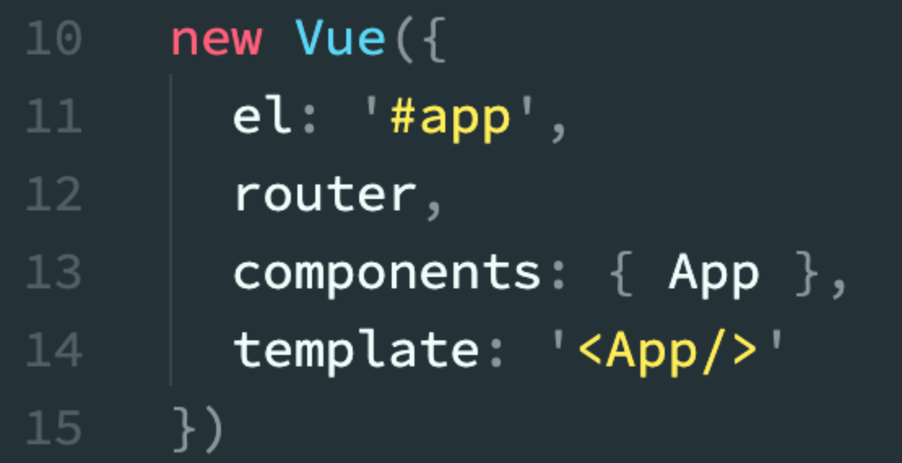

# Blog开发记录

## vue的项目结构如下
  
在src文件夹中
+ assets——静态资源，如css，js
+ components——公共组件
+ router——路由文件
+ App.vue——根组件
+ main.js——入口文件

### index.html
index.html如其他html一样，但一般只定义一个空的根节点，在main.js里面定义的实例将挂载在根节点下，内容都通过vue组件来填充。  
  

### App.vue
一个vue页面通常由三部分组成:模板(template)、js(script)、样式(style)
1. template  
    其中模板只能包含一个父节点，`<router-view/>`为`<router-view></router-view>`的简写，是子路由视图，后面的路由页面都显示在此处
2. js  
    vue通常用es6来写，用export default导出，其下面可以包含数据data，生命周期(mounted等)，方法(methods)等。
3. style  
    样式通过style标签``包裹，默认是影响全局的，如需定义作用域只在该组件下起作用，需在标签上加scoped，``  

  

### main.js
main.js主要是引入vue框架，根组件及路由设置，并且定义vue实例。  
  

### router
router下的index.js文件中的routes定义了路径为'/'的路由，该路由对应的页面是HelloWorld组件。  
  

## 页面的渲染过程
访问http://localhost:8080/显示的就是index.html页面，index.html原本只有一个根结点id="app"。  
  
main.js入口文件引入根组件App。  
  
前边已说过，根组件App中，<router-view/>是子路由视图，后面的路由页面都显示在此处，访问http://localhost:8080/，路由为‘/’，根据路由文件router/index.js，所以引入components/HelloWorld组件。

main.js中的template: '<App/>'在html页面中添加<App></App>模板，模板内容即为HelloWorld组件内容。  
  
最后渲染出的html页面如图  
  
