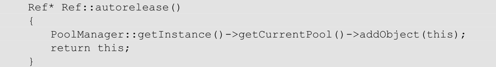
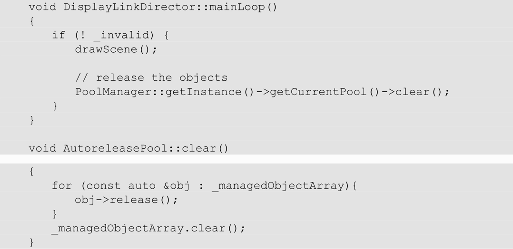

# Cocos2d-x内存管理机制
> 垃圾回收机制通常需要语言级的实现。

1. 引用计数  
    Cocos2d-x中的所有对象几乎都继承自Ref基类。Ref基类主要的职责就是对对象进行引用计数管理  
    当一个对象使用由new运算符分配的内存时，其引用计数为1，调用retain()方法会增加它的引用计数，调用release()方法会减少它的引用计数。  
    release()方法会在其引用计数为零时自动调用delete运算符删除对象并释放内存。
2. autorelease()方法声明一个智能指针
   Cocos2d-x使用autorelease()方法来声明一个对象指针为智能指针，但是这些智能指针并不单独关联某个自动变量，而是全部被加入一个AutoreleasePool中。

   在每一帧结束的时候对加入AutoreleasePool中的对象进行清理

在cocos2d-x中使用create静态方法来替代手动声明一个release对象。
```cpp
// 使用前
auto node = new Node();
node->autorelease();
// 使用后
auto node = Node::create();
```

3. AutoreleasePool队列  
    对于一些游戏对象而言，一帧的生命周期显然有些长。  
    假设一帧中会调用100个方法，每个方法创建10个autorelease对象，并且这些对象只在每个方法的作用域内被使用，则在该帧即将结束的时候，内存中的峰值为1000个游戏对象所占用的内存。这样，游戏的平均内存占用量将会大大增加，而实际上，每帧平均只需要占用10个对象的内存。  
    默认AutoreleasePool一帧被清理一次，主要是用来清理UI元素的。因为UI元素大部分都是添加到UI树中的，会一直占用内存，所以，这种情况下每帧清理并不会对内存占用有太大的影响。  
    Cocos2d-x通过实现一个AutoreleasePool队列来实现智能指针生命周期的自定义，并由PoolManager来管理这个AutoreleasePool队列

1. RefPtr\<T\>  
    Cocos2d-x 3.1引入了智能指针RefPtr<T>。RefPtr<T>是基于RAII实现的。在RAII中，动态资源的持有发生在一个对象的生命周期之内，也就是说，在对象的构造函数中分配内存，在对象的析构函数中释放内存。这可以保证资源始终会被释放（即使出现异常，也能被正常释放）。这也是各种智能指针(如`std::shared_ptr`)的基本实现原理。

# 使用cocos2d-x内存管理时的注意事项
Ref的引用计数并不是线程安全的。在多线程中，我们需要通过处理互斥锁来保证线程的安全。在 Objective-C中，由于 AutoreleasePool 是语言级别的系统实现，所以每个线程都有自己的AutoreleasePool队列。在Cocos2d-x中，从性能等方面考虑，没有提供现成的安全实现。
+ 对自定义Node的子类，为该类添加create（）方法，并使该方法返回一个autorelease对象。
+ 对自定义的数据类型，如果需要动态分配内存，继承自Ref，使用智能指针RefPtr来管理其内存的释放。
+ 对只在一个方法内部使用的Ref对象，需要使用自动回收池的，应使用自定义的AutoreleasePool来即时清理对内存的占用。
+ 不要动态分配AutoreleasePool对象，要始终使用自动变量。
+ 不要显式调用RefPtr的构造函数，始终使用隐式方式调用构造函数，因为显式的构造函数会导致同时执行构造函数和赋值操作符，这会造成一次不必要的临时智能指针变量的产生。
