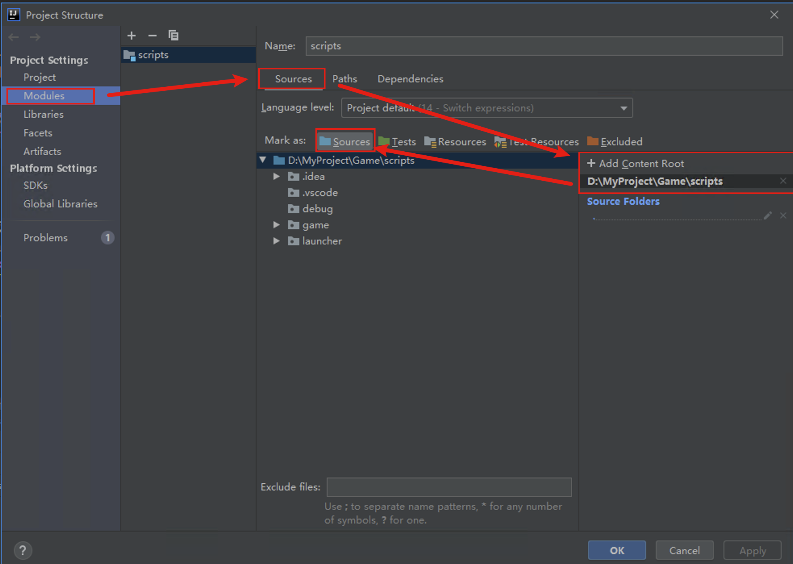

# IDEA
下载[IDEA Community版本](https://www.jetbrains.com/idea/download/)
安装并打开项目

# 注解
下载[EmmyLua](https://127.0.0.1)插件，在IDEA->File->settings->Plugins->Install Plugin from Disk选择zip文件安装
下载[Cocos-3.1.1-Api注解](https://127.0.0.1)将zip文件放入 File -> Project Structure -> Libraries 中，点击Apply->Ok

# 调试
下载[EmmyLua Attach Debugger](https://127.0.0.1)插件并安装

在File -> Project Structure -> Modules -> Sources中设置SourcesFile

打开游戏，在IDEA中选择 Run -> Attach to Process 选择游戏进程，就可以调试了。