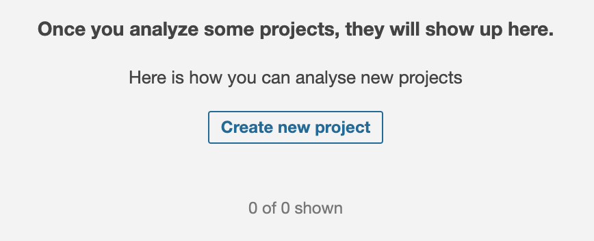
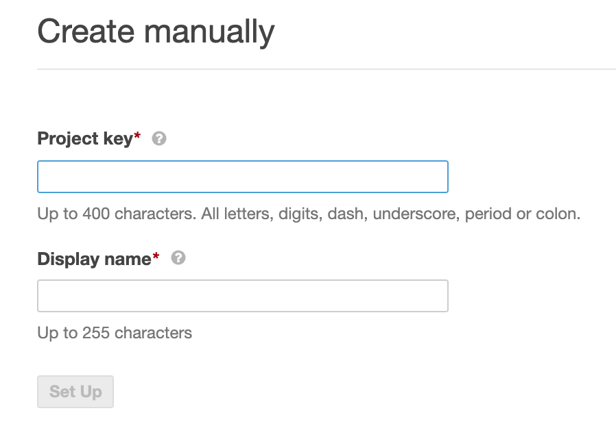
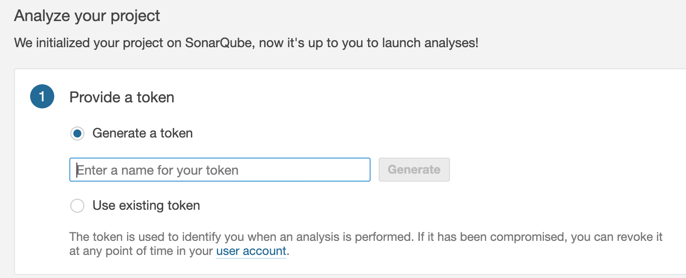
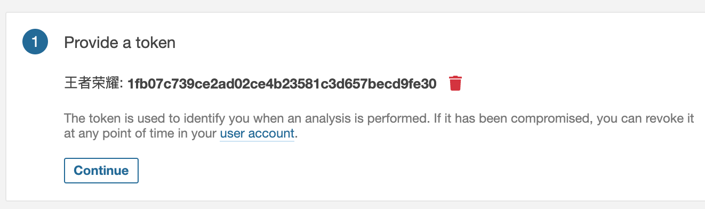
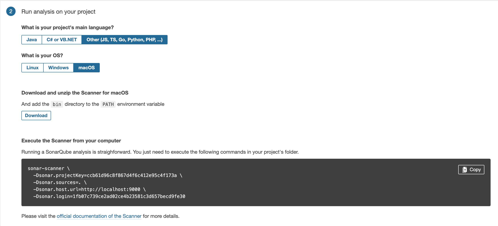

# 简单的完全安装指北
1. [点我下载SonarQube社区版](!https://www.sonarqube.org/downloads/)
2. 解压缩到文件夹
3. 启动SonarQube Server

    ```sh
    # On Windows, excute:
    C:\path\to\sonarqube\bin\windows-x86-xx\StartSonar.bat

    # On other os, excute:
    /path/to/bin/[OS]/sonar.sh console
    ```

4. 在浏览器中打开localhost:9000，以默认管理员身份登录（登录名=admin,密码=admin）
5. 创建新项目

6. Display name 和 Projet key
可以用项目名字和它的md5值，比如
王者荣耀/ccb61d96c8f867d4f6c412e95c4f173a，然后点set up

7. 为项目设置一个token


8. 选择开发语言和系统，就会自动生成命令

9. 终端进入开发目录，然后运行8中生成的命令，等待结束后，就能在网站中看到分析结果了
