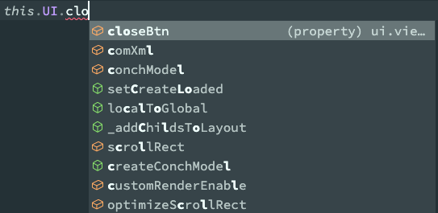
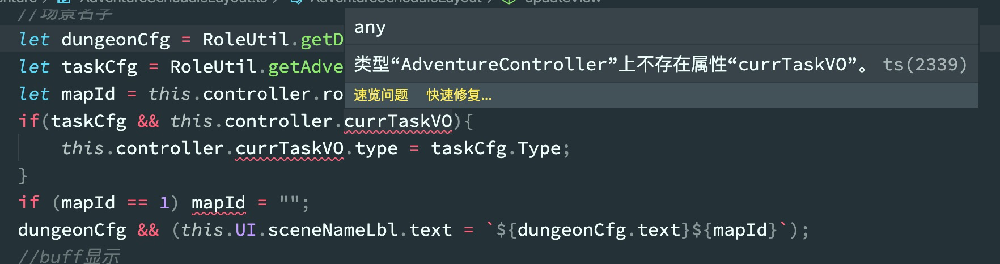
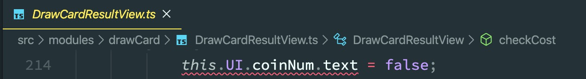
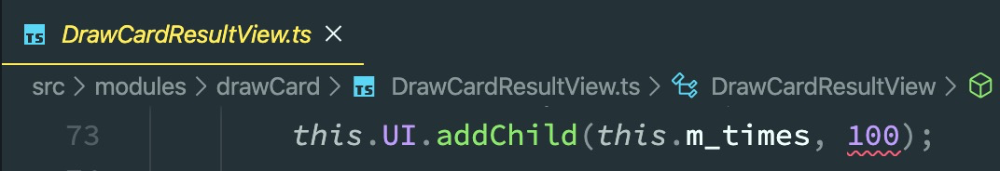
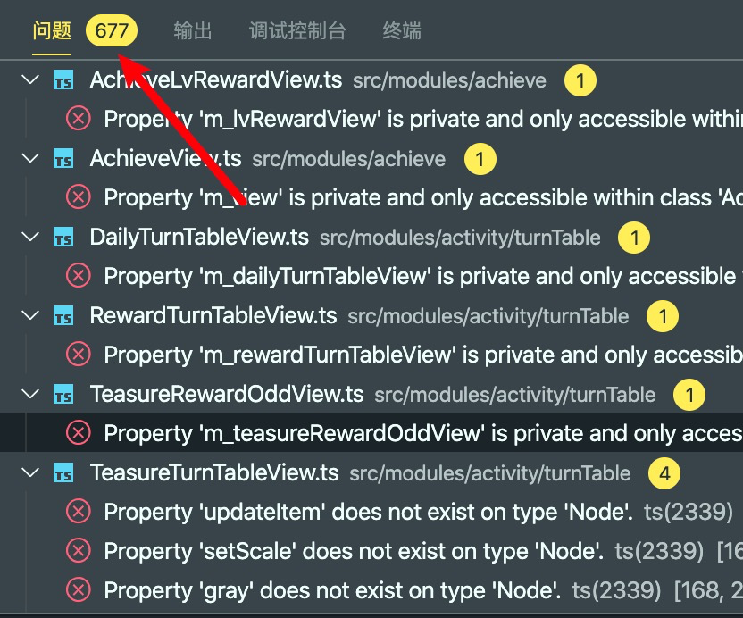

# Base类泛型
为BaseView、BaseLayout、BaseDialog类添加了模板约束，使其派生的子类在对UI和Controller的赋值后能够约束到controller和ui的具体类型：
```typescript
abstract class BaseView<basectrl extends BaseController, baseui extends Laya.View | Laya.Sprite> extends Laya.View {
    private m_ui: baseui;
    private m_controller: basectrl;
    // else
}
```
子类继承BaseView时可以在模板中明确指定类中用到的Controller和UI
```typescript
class GuildView extends BaseView<GuildController, ui.view.guild.guildViewUI> {
    // else
    private something() {
        this.UI; // (property) BaseView<GuildController, ui.view.guild.guildViewUI>.UI: ui.view.guild.guildViewUI
        this.controller; // (property) BaseView<GuildController, ui.view.guild.guildViewUI>.controller: GuildController
    }
}
```
这样访问controller和ui成员的时候就可以使用IDE的智能补全了  
  
同时这波操作暴露出了项目中非常多的隐藏的问题，由于之前的UI和Controller都是any类型的，所以IDE并不会报错，但是当显示指定了类型后，所有的异常操作都会在构建项目中显示出来，比如：
+ 访问不存在的成员  
+ 错误类型赋值引起的隐式类型转换  
+ 调用方法时错误传参  
+ 还有几百个从外部访问private成员变量的操作  
 

这些bug虽然在之后解决了，但是后来使用eslint重新检查代码规范的时候，还是发现很多不规范的写法：
+ 错误的判断条件
  + 在while判断语句中进行赋值操作
+ 禁止不必要的三元操作符
+ 空白的条件分支
+ 不规范的switch...case语句
  + 重复的case条件
  + 某个case前没有break
+ 在return语句中赋值
+ 变量/类成员在声明后未使用
+ 错误的循环
+ 错误的字符  
等等还有很多就不一一列举了  
