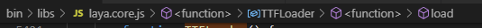

[网页字体优化](https://developers.google.com/web/fundamentals/performance/optimizing-content-efficiency/webfont-optimization?hl=zh-cn)

# 网页字体格式
目前网络上使用的字体容器格式有四种： EOT、 TTF、 WOFF 和 WOFF2。 遗憾的是，尽管选择范围很广，但仍然缺少在所有新旧浏览器上都能使用的单一通用格式： EOT 只有 IE 支持，TTF 获得了部分 IE 支持，WOFF 获得了最广泛的支持，但在某些较旧的浏览器上不受支持，而 WOFF 2.0 支持对许多浏览器来说尚未实现。
> 那我们该怎么办？不存在在所有浏览器上都能使用的单一格式，这意味着我们需要提供多种格式才能实现一致的体验：

+ 将 WOFF 2.0 变体提供给支持的浏览器。
+ 将 WOFF 变体提供给大多数浏览器。
+ 将 TTF 变体提供给旧版 Android（4.4 版以下）浏览器。
+ 将 EOT 变体提供给旧版 IE（IE9 版以下）浏览器。

# 通过压缩减小字体大小
字体是字形的集合，其中的每个字形都是一组描述字母形状的路径。 各个字形不同，但它们仍然包含大量相似信息，这些信息可通过 GZIP 或兼容的压缩工具进行压缩：

EOT 和 TTF 格式默认情况下不进行压缩。 提供这些格式时，确保您的服务器配置为应用 GZIP 压缩。
WOFF 具有内建压缩。 确保您的 WOFF 压缩工具使用了最佳压缩设置。
WOFF2 采用自定义预处理和压缩算法，提供的文件大小压缩率比其他格式高大约 30%。 如需了解详细信息，请参阅 WOFF 2.0 评估报告。

某些字体格式包含附加的元数据，如字体提示和字距调整信息，这些信息在某些平台上可能并非必要信息，这样便可进一步优化文件大小。

# 工具
fontmin-npm

# 修改过程：
1. 准备资源  
    + 首先`npm install fontmin`
    + 编写脚本autoCreateWoff
    ```js
    var win_cmd = require('node-cmd')
    var cmd = require('child_process')
    var fs = require('fs')
    var util = require('util')
    var Fontmin = require('fontmin')
    const readAsync = util.promisify(fs.readFile)
    async function getAllWords() {
        let unChinese = await readAsync('./src/FontExtract/unChineseOutput.txt');
        let chinese = await readAsync('./src/FontExtract/ChineseOutput.txt');
        return unChinese + chinese;
    }
    async function generateFont() {
        let result = await getAllWords();
        let fontmin = new Fontmin()
        fontmin.src('./FounderBlack.ttf')
        fontmin.use(Fontmin.glyph({
            text: result,
            hinting: false
        }))
        fontmin.use(Fontmin.ttf2woff({deflate: true}))
        fontmin.dest('./');
        fontmin.run((err, files) => {
            if (err) {
                throw err;
            }
            console.log(files)
        })
    }
    generateFont();
    ```
    + 把游戏中用到的FounderBlack.ttf移动到FontPruner工程根目录下。
    + 将需要加入白名单的中文字符和非中文字符分别添加到这两个文件中：
    + unChineseOutput.txt
    + ChineseOutput.txt
    + 然后在命令行中输入
        ```
        node autoCreateWoff.js
        ```
    + 资源的准备就完成了

2. 修改代码  
    + Laya中的自定义字体主要是利用WebAPI中的FontFace对象构造字体对象，然后添加至FontFaceSet字体集合中
      
      
    + 最后在loadModule方法中设置字体。
      
      
    + Laya本身是无法加载woff字体的，所以需要做一些修改
    在laya.core.js中新增woff后缀
      
      
    + 在下面两个方法中新增type参数
      
      
      
      
    + 将原本TTFLoader模块中的load方法
      
    只支持ttf格式的写法改成  
      
    + 最后结果对比（上：修改前，下：修改后）：
      
      

# 遗留问题：
1. 兼容性问题，虽然网络上说基本上所有的主流浏览器都支持woff字体，但是woff的兼容性肯定没有ttf那么全面。
2. 白名单缺少字体的问题，玩家在聊天框中输入的内容是任意的，所以精简字体的时候必定会有漏掉的字。如下图：  
  

# woff兼容性测试
|Microsoft Edge|Chrome|Opera|Safari|FireFox|QQ浏览器|IE|
|-|-|-|-|-|-|-|
|√|√|√|windows上的safari打不开，ios的可以|√|√|打不开游戏|

# 多语言
选取字体时，重要的是考虑它支持的字符集。 如果您需要将页面内容本地化成多种语言，就应该使用一种能够为用户带来一致的外观和体验的字体。这样在打不同的包体的时候也能有选择地精简字体

# 压缩
WOFF 具有内建压缩。 确保您的 WOFF 压缩工具使用了最佳压缩设置。


# 默认行为
字体延迟加载带有一个可能会延迟文本渲染的重要隐藏影响：浏览器必须构建渲染树（它依赖 DOM 和 CSSOM 树），然后才能知道需要使用哪些字体资源来渲染文本。 因此，字体请求的处理将远远滞后于其他关键资源请求的处理，并且在提取资源之前，可能会阻止浏览器渲染文本。

1. 浏览器请求 HTML 文档。
1. 浏览器开始解析 HTML 响应和构建 DOM。
1. 浏览器发现 CSS、JS 以及其他资源并分派请求。
1. 浏览器在收到所有 CSS 内容后构建 CSSOM，然后将其与 DOM 树合并以构建渲染树。
    + 在渲染树指示需要哪些字体变体在网页上渲染指定文本后，将分派字体请求。
1. 浏览器执行布局并将内容绘制到屏幕上。
    + 如果字体尚不可用，浏览器可能不会渲染任何文本像素。
    + 字体可用之后，浏览器将绘制文本像素。

# Font Loading API（项目所用）
Font Loading API（Web APIs） 提供一种脚本编程接口来定义和操纵 CSS 字体，追踪其下载进度，以及替换其默认延迟下载行为。
此外，由于您可以检查字体状态（通过 check() 方法）并追踪其下载进度，因此您还可以为在网页上渲染文本定义自定义策略：
+ 您可以在获得字体前暂停所有文本渲染。
+ 您可以为每种字体执行自定义超时策略。
+ 您可以利用回退字体解除渲染阻止，并在获得字体后注入使用所需字体的新样式。

最重要的是，您还可以混用和匹配上述策略来适应网页上的不同内容。 例如，在获得字体前延迟某些部分的文本渲染；使用回退字体，然后在字体下载完成后进行重新渲染；指定不同的超时等等。
注：在某些浏览器上，Font Loading API 仍处于开发阶段。 您可以考虑使用 FontLoader polyfill 或 webfontloader 库来提供类似功能，不过附加的 JavaScript 依赖关系会产生更多开销。

# 优化核对清单
与普遍的观点相反，使用网页字体不需要延迟网页渲染，也不会对其他性能指标产生不良影响。 在充分优化的情况下使用字体可大幅提升总体用户体验：出色的品牌推广，改进的可读性、易用性和可搜索性，并一直提供可扩展的多分辨率解决方案，能够出色地适应各种屏幕格式和分辨率。 不要害怕使用网页字体！

不过，直接实现可能招致下载内容庞大和不必要的延迟。 您需要通过对字体资产本身及其在网页上的提取和使用方式进行优化来为浏览器提供协助的环节。

+ 审核并监控您的字体使用情况：不要在网页上使用过多字体，并且对于每一种字体，最大限度减少使用的变体数量。 这将有助于为您的用户带来更加一致且更加快速的体验。
+ 对您的字体资源进行子集内嵌：许多字体都可进行子集内嵌，或者拆分成多个 unicode-range 以仅提供特定网页需要的字形。这样即可减小文件大小，并提高资源的下载速度。 不过，在定义子集时要注意针对字体重复使用的情况进行优化。例如，您一定不希望在每个网页上都下载不同但重叠的字符集。最好根据文字系统（例如拉丁文、西里尔文等）进行子集内嵌。
+ 向每个浏览器提供优化过的字体格式：每一种字体都应以 WOFF2、WOFF、EOT 和 TTF 格式提供。 务必对 EOT 和 TTF 格式应用 GZIP 压缩，因为默认情况下不会对其进行压缩。
+ 在 src 列表中优先列出 local()：在 src 列表中首先列出 local('Font Name') 可确保不会针对已安装的字体发出 HTTP 请求。
+ 使用 <link rel="preload">、font-display 或 Font Loading API 来自定义字体加载和渲染：默认的延迟加载行为可能会导致延迟渲染文本。 您可以通过这些网络平台功能为特定字体替换这一行为，以及为网页上的不同内容指定自定义渲染和超时策略。
+ 指定重新验证和最佳缓存策略：字体是不经常更新的静态资源。 确保您的服务器提供长期的 max-age 时间戳和重新验证令牌，以实现不同网页之间高效的字体重复使用。 如果使用 Service Worker，则适合采用缓存优先策略。

# 后续优化内容
1. 从配置表和ts文件中把所有的中文提取出来，然后加入现有的白名单
1. 继续压缩现有的字体（现在的压缩工具还不是最优的）
2. 对旧版的浏览器进行支持