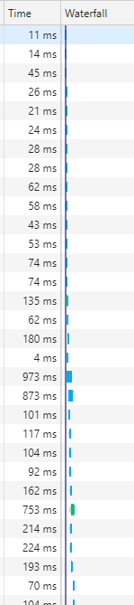
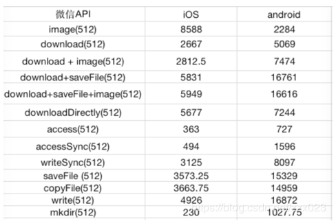
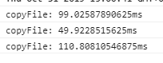

微信优化记录的工作总结具体如下，请查收。

### 解决问题：
1. 微信小游戏加载资源卡顿的问题

### 问题描述：
首次进入微信小游戏（也包括一个功能被首次打开）时卡的和PPT一样。

### 分析：
1. **因为网速问题导致的卡顿** 
      
2. **Laya的微信适配器资源缓存策略导致的卡顿**  
    在Laya.wxmini.js中资源是以以下的方式加载的：
    ```javascript
		Loader.prototype._loadImage=MiniImage.prototype._loadImage;
		// 重写了Loader中的_loadImage
		// 在wxmini中，MiniLoader的_loadImage会检查微信的文件系统中是否已经缓存过待加载的文件,如果本地缓存中已经有该文件，就直接用MiniImage.onCreateImage这个接口创建图片，如果本地缓存中没有该文件，就会调用MiniFileMgr.downOtherFiles下载这个文件
        MiniFileMgr.downOtherFiles = function(fileUrl, callBack, readyUrl, isSaveFile, isAutoClear) {
            // somecode
            MiniFileMgr.wxdown({
                url: fileUrl,
                success: function(data) {
                    if (data.statusCode === 200) {
                        // somecode
                        MiniFileMgr.copyFile(data.tempFilePath, readyUrl, ...otherParam);
                    }
                    // call callBack Function
                }
            })
        }
        MiniFileMgr.downOtherFiles(fileUrl,new Handler(MiniImage,MiniImage.onDownImgCallBack,[url,thisLoader]),url);
    ```
    在 MiniFileMgr.downOtherFiles 中，调用微信的 downLoadFile 接口（代码中的 MiniFileMgr.wxdown ）下载图片，在图片下载好了之后，立即调用微信的 copyFile 接口（代码中的 MiniFileMgr.copy ）将临时文件复制到本地缓存目录下，然后才调用 MiniImage.onCreateImage 接口创建图片。从请求加载一张图片开始，经过了 **下载->缓存->创建** 一系列的步骤之后，才将图片显示出来。而通过这篇文章 [Creator 2.0.x 微信小游戏加载优化（一）：定制wx-downloader](https://blog.csdn.net/zzx023/article/details/89842503) 可以看到
      
    在Android系统的手机中，copyFile的操作是十分耗时的（由图片知，copyFile耗时为downloadFile的3倍左右）。  
    在代码中通过console.time与async await操作的结合也可以测试出异步函数的执行耗时：
      
    实际上copyFile的执行速度和文件大小也是成正比的，即文件越大，复制越耗时，单个文件复制耗时大概在3-6帧左右，所以当图片同时下载数量过多的时候，整个游戏就会卡的和ppt一样，因为不停的在重复 **下载->缓存->创建** 的步骤
3. **读写文件和解析文件的耗时**  
    除此之外，读写文件和解析文件的耗时也占了很大的比重。特别是下载完sk文件后还要对其进行解析，这也是耗时的大头。

### 解决方案
1. 这得通过减小资源的大小和CDN的配置来优化下载问题  
2. 在Cocos Creator2.0.9的版本中，wx-downloader里面对于这一块的处理
    ```javascript
    function cacheFile (url, isCopy, cachePath) {
        cacheQueue[url] = { isCopy, cachePath };

        if (!checkNextPeriod) {
            checkNextPeriod = true;
            function cache () {
                checkNextPeriod = false;
                for (var srcUrl in cacheQueue) {
                    if (!wxDownloader.outOfStorage) {
                        var item = cacheQueue[srcUrl]
                        var localPath = wxDownloader.cacheDir + '/' + item.cachePath;
                        var func = wxFsUtils.copyFile;
                        if (!item.isCopy) func = wxFsUtils.downloadFile; 
                        func(srcUrl, localPath, function (err) {
                            if (err)  {
                                errTest.test(err.message) && (wxDownloader.outOfStorage = true);
                                return;
                            }
                            cachedFiles[item.cachePath] = 1;
                            writeCacheFile();
                            if (!isEmptyObject(cacheQueue) && !checkNextPeriod) {
                                checkNextPeriod = true;
                                setTimeout(cache, wxDownloader.cachePeriod);
                            }
                        });
                        delete cacheQueue[srcUrl];
                    }
                    return;
                }
            };
            setTimeout(cache, wxDownloader.cachePeriod);
        }
    }
    ```
    在Cocos Creator中，wx.downloadFile的回调并不是直接调用copyFile，而是通过setTimeout设置延时后再复制文件，这样流程就变成了 **下载->创建->显示->缓存**，可以保证先将图片展示给玩家，然后再保存临时文件。  
    但实际项目使用的过程中发现，当需要远程加载的文件数量多，且其中有一些较大的文件时，Cocos的这个优化效果并不是很显著。 于是通过这篇文章[Creator 2.0.x 微信小游戏加载优化（一）：定制wx-downloader](https://blog.csdn.net/zzx023/article/details/89842503)获得了一个比较好的优化方案：加载图片时，不适用微信提供的下载接口，而是直接使用远程URL展示图片，在图片加载完之后，后续再通过wx.downloadFile下载一次，并缓存至本地。  
    具体的代码实现（其实只改了一点点）在MiniImage.onCreateImage中的onload：
    ```javascript
    // 修改前
    var onload=function (){
        clear();
        thisLoader.onLoaded(image);
    };
    // 修改后
    var onload = function () {
        clear();
        thisLoader.onLoaded(image);
        setTimeout(() => {
            if (!isLocal) {
                MiniFileMgr.downOtherFiles(sourceUrl, null, sourceUrl)
            }
        }, downLoadPeriod);
    };
    // 在downOtherFiles的wxdown回调中，将下载完成后直接拷贝到本地，改为了下载完成后调用cacheAsset函数
    MiniFileMgr.downOtherFiles = function (fileUrl, callBack, readyUrl, isSaveFile, isAutoClear) {
        (readyUrl === void 0) && (readyUrl = "");
        (isSaveFile === void 0) && (isSaveFile = false);
        (isAutoClear === void 0) && (isAutoClear = true);
        let p = MiniFileMgr.doPromise({ url: fileUrl }, MiniFileMgr.wxdown);
        p.then(res => {
            let data = res;
            if (data.statusCode === 200) {
                if ((MiniAdpter.autoCacheFile || isSaveFile) && readyUrl.indexOf("wx.qlogo.cn") == -1 && readyUrl.indexOf(".php") == -1) {
                    MiniFileMgr.cacheAsset(fileUrl, data.tempFilePath);
                    // MiniFileMgr.copyFile(data.tempFilePath, readyUrl, null, "", isAutoClear);
                }
                callBack != null && callBack.runWith([0, data.tempFilePath]);
            } else {
                callBack != null && callBack.runWith([1, data]);
            }
        })
    }
    // 调用cacheAsset函数时，会将远程路径和临时文件的路径放入一个队列中，在每个MiniFileMgr.cachePeriod周期对这个队列进行维护： 出队一个文件，进行copyFile操作，在copyFile操作成功后的回调中再进行下一次维护任务的设置，这样就保证了每个周期只会有一个文件在缓存，不会造成卡顿的体验。
    MiniFileMgr.cacheAsset = function (url, localPath) {
        MiniFileMgr.cacheQueue.push({ url, localPath });

        function cache() {
            if (MiniFileMgr.cacheQueue.length == 0) {
                return;
            }
            let storeTask = MiniFileMgr.cacheQueue.shift();
            setTimeout(() => {
                MiniFileMgr.copyFile(storeTask.localPath, storeTask.url, Handler.create(MiniFileMgr, cache), 'utf8');
            }, MiniFileMgr.cachePeriod);
        }
        cache();
    }
    ```
3. 目前是想到了两种解决办法：一是通过引入Worker来创建新的线程，用于解析sk文件，这样解析sk文件时就不会阻塞主线程;二是引入lz4压缩算法，在Worker线程中对下载好的文件进行压缩和解压，lz4算法是所有算法中解压速度最快的算法，但是还是要考虑参数传递和线程通信过程的耗时加上压缩与解压的耗时。

### 优化结果
测试内容：从按下进入游戏按钮，到首屏所有资源下载完毕的耗时  
内网测试结果：  
优化前：25s；  
优化后：12s；  