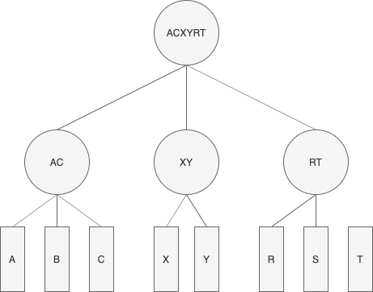

# 用树形模型管理红点提示

## 需求描述
+ 不同级红点状态可传递
+ 同级红点不相互影响
+ 红点状态可配置
+ 红点可记录数量

## 服务器红点
所有定义的红点状态
```typescript
```

## 客户端红点

## 树形模型


通过客户端来手动配置树形结构（可通过配置表实现），如上图的模型转为下面的json格式的配置：
```json
{
    "1": {
        id: 1,
        desc: "ACXYRT",
        child: [2, 3, 4]
    },
    "2": {
        id: 2,
        desc: "AC",
        child: [5, 7]
    },
    "3": {
        id: 3,
        desc: "XY",
        child: [8, 9]
    },
    "4": {
        id: 4,
        desc: "RT",
        child: [10, 12]
    },
    "5": {
        id: 5,
        desc: "A",
    },
    "6": {
        id: 6,
        desc: "B",
    },
    "7": {
        id: 7,
        desc: "C",
    },
    "8": {
        id: 8,
        desc: "X",
    },
    "9": {
        id: 9,
        desc: "Y",
    },
    "10": {
        id: 10,
        desc: "R",
    },
    "11": {
        id: 11,
        desc: "S",
    },
    "12": {
        id: 12,
        desc: "T",
    },
}
```

代码实现，根据配置表构造树，更改节点状态时，会同步所有的父节点状态，不会影响子节点和兄弟节点。

```typescript
interface RedInfo{
    des_id : number  // 活动ID
    state  : number   // 红点状态： 0无 1有 -1关闭
}
enum RedTipType {
    // 预定义红点ID
}
class RedTipManager {
    private static m_instance: RedTipManager;
    private redCfg: Config_Red
    private m_redStateMap = {};

    private constructor() {}

    public static get instance(): RedTipManager { /*单例模式*/ }

    public init() {
        // 初始化时构造红点树结构
        // 向服务端请求红点状态
        // 状态返回
    }

    public updateInfo(vo: RedInfo[]) {
        for (const redInfo of vo.idlist) {
            this.m_redStateMap[redInfo.id] = redInfo
        }
        GlobalEventSystem.fire(GlobalEventType.RED_TIP_CHANGE)
    }

    public getRedInfo(id): RedInfo {
        // 遍历子树
        return this.m_redStateMap[id]
    }
}
```