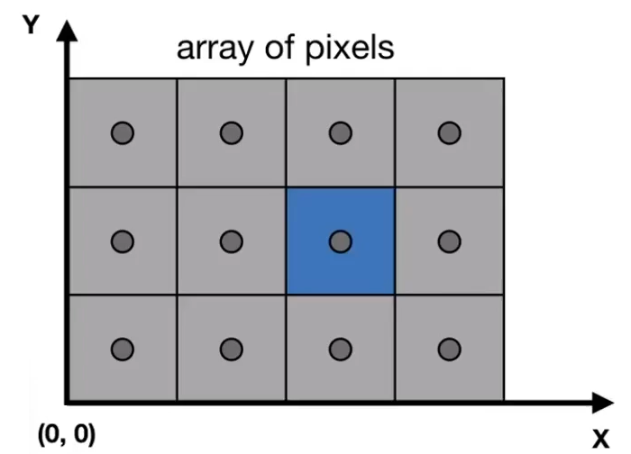

# 光栅化
- 将**几何图元**（3D三角形/多边形）投影到屏幕上
- 将投影图元分解为**片段**（像素）
- 电子游戏（实时应用）的黄金标准

## 什么是屏幕？
- 像素阵列
- 数组大小：分辨率
- 典型的栅格显示 

## 什么是光栅化
光栅化 == 画在屏幕上

## 像素（FYI，“图片元素”的缩写）
- 像素是一个颜色均匀的小正方形
- 颜色是（红色，绿色，蓝色）的混合物

## 定义屏幕空间
- 像素索引为以(x，y)的形式，其中x和y都是整数
- 像素索引来自(0，0)至(width-1，height-1)
- 像素的中心(x, y)在(x + 0.5, y + 0.5) 上
- 屏幕覆盖范围为(0, 0)到(width, height)

- 与z无关
- 在xy平面上变换：\[-1，1\] 2到\[0，width\] $\times$ \[0，width\]
- 视口变换矩阵：

$$
M_{viewport} = \left[\begin{matrix}
    \frac{width}{2} & 0 & 0 & \frac{width}{2} \\
    0 & \frac{height}{2} & 0 & \frac{height}{2} \\
    0 & 0 & 0 & 0 \\
    0 & 0 & 0 & 0
\end{matrix}\right]
$$
