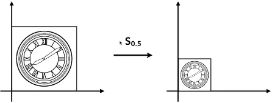
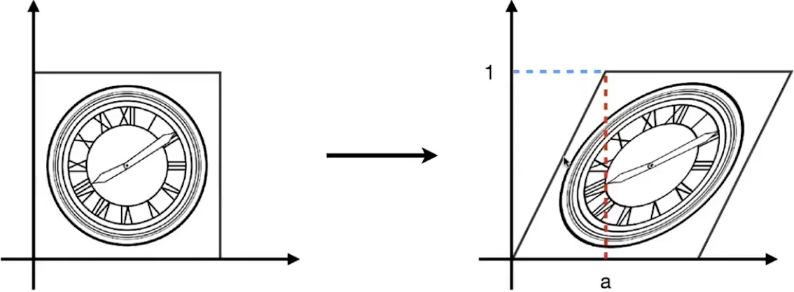
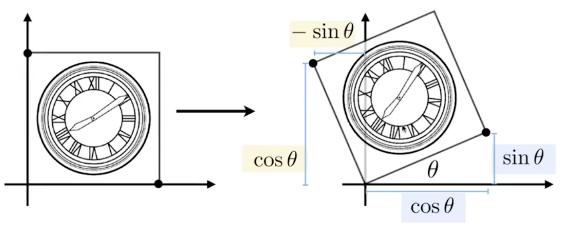

# 变换

1. 为什么要学习变换
2. 2D转换：旋转，缩放，剪切
3. 齐次坐标
4. 组成变换
5. 3D转换

## 缩放

$\left[\begin{matrix}x'\\y'\end{matrix}\right]=\left[\begin{matrix}s_{x}&0\\0&s_{y}\end{matrix}\right]\left[\begin{matrix}x\\y\end{matrix}\right]$

## 切变

### 水平方向切变  
$\left[\begin{matrix}x'\\y'\end{matrix}\right]=\left[\begin{matrix}1&a\\0&1\end{matrix}\right]\left[\begin{matrix}x\\y\end{matrix}\right]$
### 竖直方向切变
$\left[\begin{matrix}x'\\y'\end{matrix}\right]=\left[\begin{matrix}1&0\\a&1\end{matrix}\right]\left[\begin{matrix}x\\y\end{matrix}\right]$

## 旋转

$R_\theta=\left[\begin{matrix}cos\theta&-sin\theta\\sin\theta&cos\theta\end{matrix}\right]$

#### 旋转矩阵的推导
用$(1, 0)$和$(0, 1)$两个特殊的点可以推导出旋转矩阵

## 矩阵的线性变换
缩放、切变、旋转的矩阵都可以写成:  
$x'=ax+by\\y'=cx+dy$   
即  
$\left[\begin{matrix}x'\\y'\end{matrix}\right]=\left[\begin{matrix}a&b\\c&d\end{matrix}\right]\left[\begin{matrix}x\\y\end{matrix}\right]$  
即 $x=Mx$ 这样的形式，所以这些矩阵都是线性矩阵

## 平移

向量的平移不变性

## 矩阵的仿射变换

## 逆矩阵

旋转矩阵求逆矩阵：转置