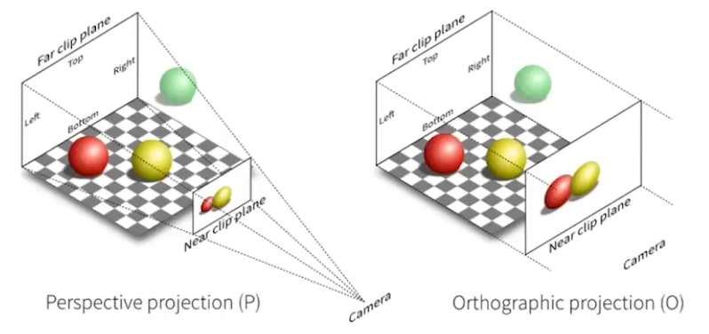
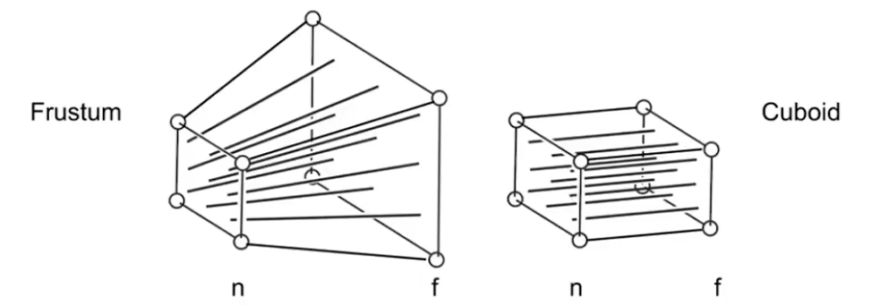
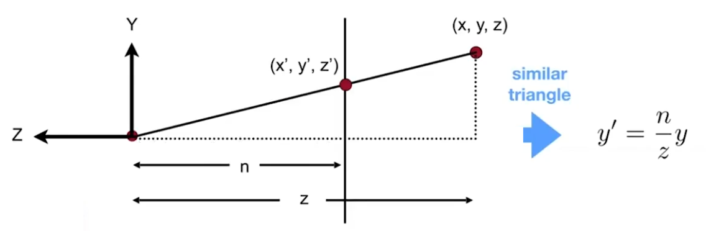
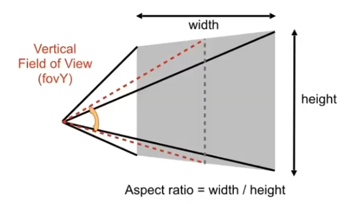
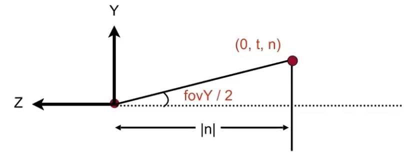

# 观测变换
- M(model)
- V(view)
  1. Position(位置e)
  2. Look-at /gaze direction(观察方向g)
  3. Up direction(上方向t)
- P(projection)
## 视图变换
1. 平移到原点
2. 旋转$g$到$-Z$轴
3. 旋转$t$到$Y$轴
4. 旋转$g \times t$到$X$轴

**$M_{view}$ 该如何写**
- $M_{view} = R_{view}T_{view}$
- 平移到原点: 
$$
T_{view}=\left[\begin{matrix} 
   1 & 0 & 0 & -x_{e}\\ 
   0 & 1 & 0 & -y_{e}\\
   0 & 0 & 1 & -z_{e}
\end{matrix}\right]
$$
- 旋转$g$到$-Z$轴, $t$到$Y$轴, $(g \times t)$ 到 $X$轴
- 可以先求逆变换再求逆就可以得到答案
$$
R^{-1}_{view} = 
\left[\begin{matrix}
    x_{\hat{g} \times \hat{t}} & x_{t} & x_{-g} \\
    y_{\hat{g} \times \hat{t}} & y_{t} & y_{-g} \\
    z_{\hat{g} \times \hat{t}} & z_{t} & z_{-g} \\
\end{matrix}\right] \Rightarrow
R_{view} = 
\left[\begin{matrix}
    x_{\hat{g} \times \hat{t}} & y_{\hat{g} \times \hat{t}} & z_{\hat{g} \times \hat{t}} \\
    x_{t} & y_{t} & z_{t} \\
    x_{-g} & y_{-g} & z_{-g} \\
\end{matrix}\right]
$$

## 投影变换
透视投影vs正交投影

### 正交投影(Orthographic projection)
正交投影矩阵表示, 首先**平移**（到原点），然后**缩放**（将长宽高度转换为2）：
$$
M_{ortho} = \left[\begin{matrix}
    \frac{2}{r-l} & 0 & 0 & 0 \\
    0 & \frac{2}{t-b} & 0 & 0 \\
    0 & 0 & \frac{2}{n-f} & 0 \\
    0 & 0 & 0 & 1
\end{matrix}\right]
\left[\begin{matrix}
1 & 0 & 0 & -\frac{r+l}{2} \\
0 & 1 & 0 & -\frac{t+b}{2} \\
0 & 0 & 1 & -\frac{n+f}{2} \\
0 & 0 & 0 & 1 
\end{matrix}\right]
$$
### 透视投影(Perspective projection)
+ 最常见于计算机图形学，美术，视觉系统
+ 近大远小
+ 平行线不平行,收敛到一个点

**如何理解透视投影**

将透视投影区域(Frustum)挤压成正交投影区域(Cuboid)
+ 近平面上的任何一点都不会改变
+ 远平面上的任何点的$Z$都不会改变

透视投影矩阵：
$$
M^{4 \times 4}_{persp \rightarrow ortho} = \left(\begin{matrix}
     n & 0 & 0 & 0 \\
     0 & n & 0 & 0 \\
     0 & 0 & n + f & -nf \\
     0 & 0 & 0 & n
\end{matrix}\right)
$$
推导过程：待填写

**fovY:**

将fovY和宽高比转换为l，r，b，t:
$$
tan\frac{fovY}{2} = \frac{t}{|n|} \\
aspect = \frac{r}{t}
$$
