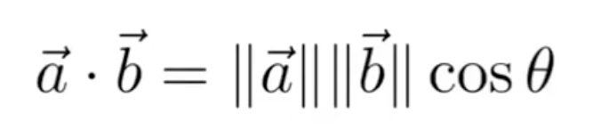
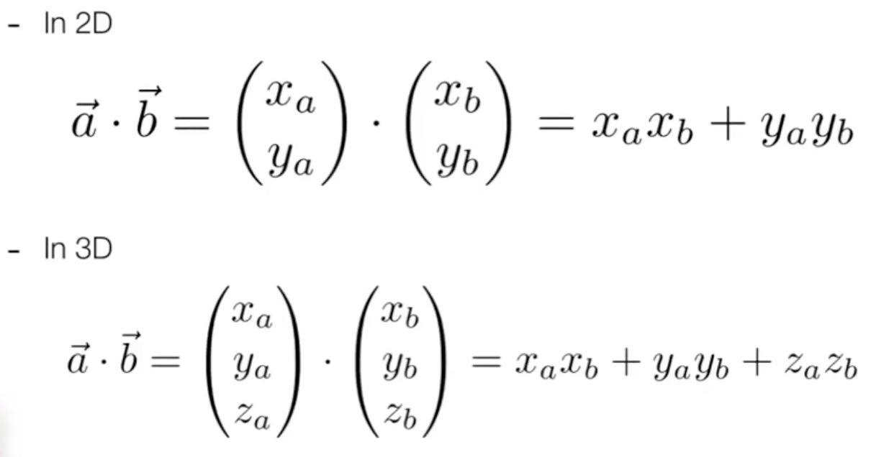
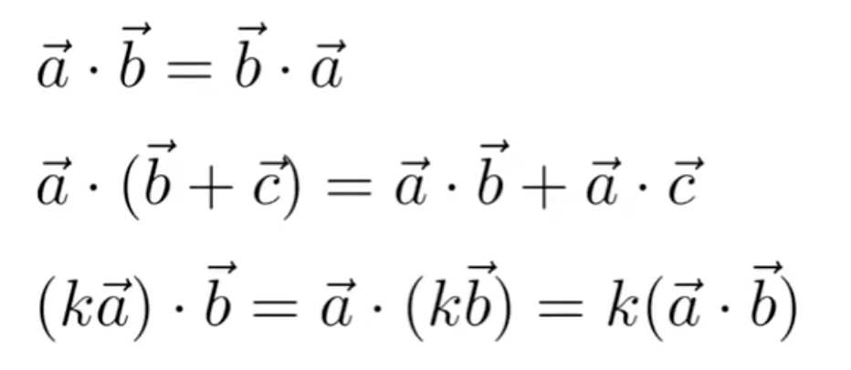
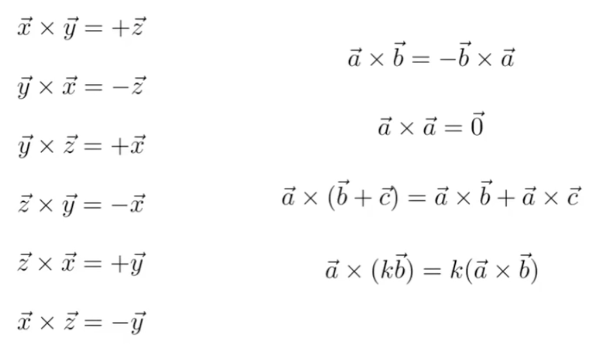
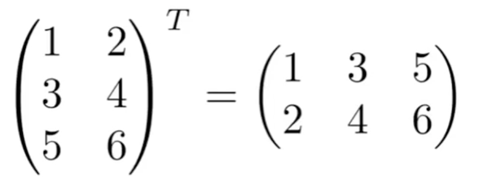
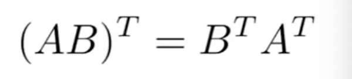
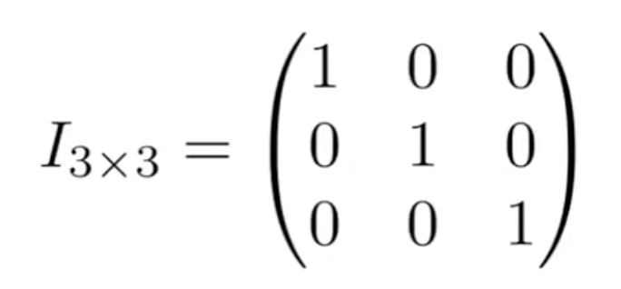
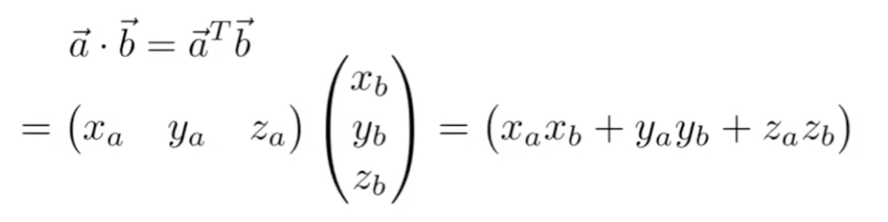
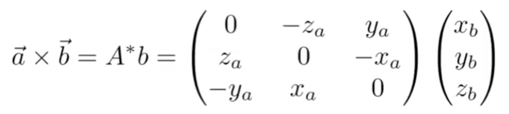

# 图形学基础，线性代数
+ 向量(点积，叉积，...
+ 矩阵(矩阵-矩阵，矩阵-向量m ..)
+ 例如：
  + 一个点是否为向量(？)
  + 诸如平移或旋转对象之类的操作可以是矩阵向量乘法

## 向量
### 向量点乘  

逐分量相乘，然后相加：  

运算法则：  

**作用：**
+ 查找两个向量之间的角度(例如光源和表面之间的角度的余弦值)
+ 查找一个向量在另一向量上的投影
+ 测量两个方向的接近程度
+ 分解向量
+ 确定方向(点乘结果大于0为正，小于0为负数等于0垂直)

### 向量叉乘
+ 叉积与两个初始向量
+ 正交由右手法则确定的方向
+ 在构造坐标系中很有用

运算法则：  

**作用：**
+ 判断点是否在闭合的多边形内部

## 矩阵
### 矩阵乘法
(M\*N)(N\*P) = (M\*P)  
矩阵乘法结果中的第(i,j)个元素是
矩阵M中第i行的向量与矩阵N中第j列的向量的点积

运算法则：
+ (AB)C = A(BC)
+ A(B + C)= AB + AC
+ (A + B)C = AC + BC
+ 没有交换律
  
### 矩阵转置

运算法则

### 单位矩阵

用于求逆矩阵

### 向量点乘叉乘转换为矩阵计算

