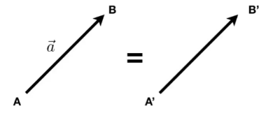
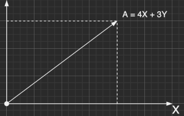
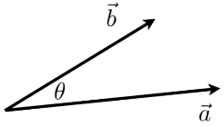

# 图形学所需的简单线性代数

## 向量

+ 向量常写作$\vec{a}$或者粗体的$a$
+ 或者使用起点和终点的表示: $\vec{AB} = B - A$
+ 向量拥有**长度**和**方向**
+ 没有绝对的起始位置

### 向量的长度表示
+ 向量的长度一般写作 $||\vec{a}||$
+ 单位向量
  - 单位向量的长度都为$1$
  - 向量的单位长度算法为: $\hat{a} = \vec{a}\ /\ ||\vec{a}||$
  - 单位向量是用来表示向量的方向的

### 向量表示

$A = \left(\begin{matrix} x \\ y \end{matrix}\right)\qquad A^{T} = \left(x,\ y\right)\qquad ||A|| = \sqrt{x^{2} + y^{2}}$

**在图形学中，向量一般为列向量。**
### 向量点乘  

点乘公式：$\vec{a} \cdot \vec{b} = ||\vec{a}||\ ||\vec{b}||\ cos\theta$ 

可以通过点乘公式的变换算出两个向量的夹角：

$cos\theta = \frac{\vec{a} \cdot \vec{b}}{||\vec{a}||\ ||\vec{b}||}$

并且对于单位向量而言：

$cos\theta = \hat{a}\cdot\hat{b}$

#### 点乘的运算法则
+ $\vec{a} \cdot \vec{b} = \vec{b} \cdot \vec{a}$
+ $\vec{a} \cdot (\vec{b} + \vec{c}) = \vec{a}\cdot\vec{b}+\vec{a} \cdot \vec{c}$
+ $(k\vec{a})\cdot\vec{b} = \vec{a}\cdot(k\vec{b}) = k(\vec{a}\cdot\vec{b})$

#### 直角坐标系中的向量点乘
+ 在2D坐标系中: $\vec{a}\cdot\vec{b} = \left(\begin{matrix}x_{a}\\y_{a}\end{matrix}\right)\cdot\left(\begin{matrix}x_{b}\\y_{b}\end{matrix}\right) = x_{a}x_{b}+y_{a}y_{b}$
+ 在3D坐标系中: $\vec{a}\cdot\vec{b} = \left(\begin{matrix}x_{a}\\y_{a}\\z_{a}\end{matrix}\right)\cdot\left(\begin{matrix}x_{b}\\y_{b}\\z_{b}\end{matrix}\right) = x_{a}x_{b}+y_{a}y_{b}+z_{a}z_{b}$

#### 利用点乘计算$\vec{b}$在$\vec{a}$上的投影
+ $\vec{b}_{\perp}$一定会沿着$\vec{a}$(或者是$\hat{a}$)
+ $\vec{b}_{\perp} = k\hat{a}$ 
+ 系数$k$的计算方法为: $k = ||\vec{b}_{\perp}|| = ||\vec{b}||cos\theta$

> 点乘的最后结果是一个值

#### 点乘的作用
+ 查找两个向量之间的角度(例如光源和表面之间的角度的余弦值)
+ 查找一个向量在另一向量上的投影
+ 测量两个方向的接近程度
+ 任意地分解向量
+ 确定方向的一致性(点乘结果大于0为正，小于0为负数等于0垂直)

### 向量叉乘
+ 叉积与两个初始向量正交
+ 正交的方向由右手螺旋法则确定，右手旋转方向为叉乘的顺序
+ 在构造三维坐标系中很有用

#### 运算法则：  
$$
\vec{x}\times\vec{y} = +\vec{z}\\
\vec{y}\times\vec{x} = -\vec{z}\\
\vec{y}\times\vec{z} = +\vec{x}\\
\vec{z}\times\vec{y} = -\vec{x}\\
\vec{z}\times\vec{x} = +\vec{y}\\
\vec{x}\times\vec{z} = -\vec{y}\\
\vec{a}\times\vec{b} = -\vec{b}\times\vec{a}\\
\vec{a}\times\vec{a} = \vec{0}\\
\vec{a}\times(\vec{b}+\vec{c}) = \vec{a}\times\vec{b} + \vec{a}\times\vec{c}\\
\vec{a}\times(k\vec{b}) = k(\vec{a}\times\vec{b})
$$

#### 向量叉乘的运算
+ 向量与向量叉乘: $\vec{a}\times\vec{b} = \left(\begin{matrix}y_{a}z_{b}-y{b}z{a}\\z_{a}x_{b}-x_{a}z_{b}\\x_{a}y_{b}-y_{b}x_{a}\end{matrix}\right)$

+ 向量与矩阵叉乘:$\vec{a}\times\vec{b} = A * b = \left(\begin{matrix}0&-z_{a}&y_{a}\\z_{a}&0&-x_{a}\\-y_{a}&x&0\end{matrix}\right)\left(\begin{matrix}x_{b}\\y_{b}\\z_{b}\end{matrix}\right)$

#### 叉乘的作用
+ 判断一个点是否在闭合规则多边形的内部

### 正交坐标系
+ 任何一组3个向量（在3D坐标系中）：
$$
||\vec{u}||=||\vec{v}||=||\vec{w}||=1\\
\vec{u}\cdot\vec{v}=\vec{v}\cdot\vec{w}=\vec{u}\cdot\vec{w}\\
\vec{w}=\vec{u}\times\vec{v}\quad(右手定则)
$$
+ 由此，任意一个向量都可以分解为$\vec{p}=(\vec{p}\cdot\vec{u})\vec{u}+(\vec{p}\cdot\vec{v})\vec{v}+(\vec{p}\cdot\vec{w})\vec{w}$ (利用点乘算向量在轴上的投影)
¡
## 矩阵
+ 数字数组（$m\times n = m$行，$n$列）
+ 在图形学中，普遍用于表示变换(平移，旋转，剪切，缩放)

### 矩阵乘法
A矩阵中的列数必须与B中的行数相等

$(M*N)(N*P) = (M*P)$

如: 一个3行2列的矩阵和2行4列的矩阵相乘:
$$
\left(\begin{matrix}
1&3\\5&2\\0&4
\end{matrix}\right)
\left(\begin{matrix}
3&6&9&4\\2&7&8&3
\end{matrix}\right)
=
\left(\begin{matrix}
9&?&33&13\\
19&44&61&26\\
8&28&32&?
\end{matrix}\right)
$$
矩阵乘法结果中的第$(i,j)$个元素是矩阵$M$中第$i$行的向量与矩阵$N$中第$j$列的向量的点积

运算法则：
+ **没有任何交换律**
+ 有结合律和分配律
  + $(AB)C = A(BC)$
  + $A(B + C)= AB + AC$
  + $(A + B)C = AC + BC$

### 矩阵转置
$$
\left(\begin{matrix}
1&2\\3&4\\5&6
\end{matrix}\right)^{T}
=
\left(\begin{matrix}
1&3&5\\2&4&6
\end{matrix}\right)
$$

#### 矩阵转置的性质
$(AB)^{T}=B^{T}A^{T}$ 

### 单位矩阵
$I_{3\times3}=\left(\begin{matrix}1&0&0\\0&1&0\\0&0&1\end{matrix}\right)$

**单位矩阵用于求逆矩阵**

$AA^{-1}=A^{-1}A=I$
$(AB)^{-1}=B^{-1}A{-1}$

### 向量点乘叉乘转换为矩阵计算
+ 点乘: $\vec{a}\cdot\vec{b}=\vec{a}^{T}\vec{b}=\left(\begin{matrix}x_{a}&y_{a}&z_{a}\end{matrix}\right)\left(\begin{matrix}x_{a}\\y_{a}\\z_{a}\end{matrix}\right)=(x_{a}x_{b}+y_{a}y_{b}+z_{a}z_{b})$
+ 叉乘: $\vec{a}\times\vec{b}=A*b=\left(\begin{matrix}0&-z_{a}&y_{a}\\z_{a}&0&-x_{a}\\-y_{a}&x_{a}&0\end{matrix}\right)\left(\begin{matrix}x_{b}\\y_{b}\\z_{b}\end{matrix}\right)$
