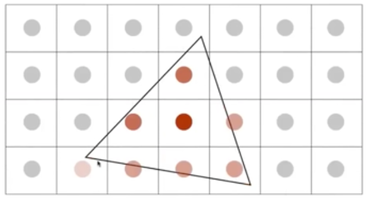

## 采样

Bounding Box(包围盒)内的变换才需要进行光栅化

采样=重复原始信号的频谱

锯齿问题(信号走样Aliasing)

**Artifacts**：表示采样中的一些问题，如锯齿和摩尔纹，都是采样中的产生问题

**走样(Aliasing)的本质原因**：信号变换速度过快，采样的速度跟不上。(频谱在复制的过程中高频部分重叠了)

假设用同样的采样方法(间隔同样的频率)去采样5个不同频率的函数，得到的结果不会满足傅里叶变换函数(采样结果无法准确地还原到原函数)：

这种情况可能会导致采样两种完全不同的函数时得到了完全相同的结果。原因就是高频信号采样不足，采样错误地来自低频信号：

**在给定采样结果中无法区分两个频率的情况就被称为“走样”**

## 频域(Frequency Domain)
频域（频率域）——自变量是频率，即横轴是频率，纵轴是该频率信号的幅度，也就是通常说的频谱图。频谱图描述了信号的频率结构及频率与该频率信号幅度的关系。

## 抗锯齿\反走样(AntiAliasing)
### 滤波
+ 高通滤波：将图像中的低频信号抹去，剩下高频信号的滤波
+ 低通滤波：只让图像中的低频信号留下，抹去高频信号

### 卷积
将某个信号和其周围的信号做一个加权平均值，得到的结果返回到原来的信号中，这个操作叫做卷积。

**卷积定理**
在空间域中的卷积等于在频域中的乘法，反之亦然

通过卷积来进行反走样：
+ 第一种方法：  
可在空间域内通过卷积进行滤波

+ 第二种方法：
 1. 变换到频域（傅里叶变换）
 2. 乘以卷积核的傅立叶变换
 3. 变换回空间域（逆傅立叶）

### 抗走样的方法
方法1：提高采样率
+ 实质上增加了Fourier域中副本之间的距离
+ 更高分辨率的显示器，传感器，帧缓冲器...
+ 但是：昂贵且可能需要非常高分辨率

方法2：抗锯齿
+ 采样前滤除高频(低通滤波)

## 实用的滤波器
最简单的方式就是1-pixel box filter

栅格化一个三角形时，像素内的平均值(或是卷积) f(x，y) = 三角形覆盖的像素。

## SuperSampling(Multiple Sample AntiAliasing)
通过对一个像素内的多个位置进行采样并取其平均值来估算一个像素的走样结果：

例如普通走样和2x2的多重走样：
普通走样

2x2多重走样的过程

2x2多重走样的结果

## 其余
+ 抗锯齿的代价：增大计算量
+ 其余的抗锯齿方法：
  + FXAA(Fast Approximate AntiAliasing)
  + TAA(Temporal AntiAliasing)
+ 超分辨率
+ 