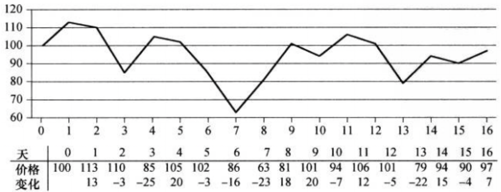

# 分冶策略

在分治策略中，递归地求解一个问题时，在每层递归中应用如下三个步骤：
+ **分解** 将问题划分为一些子问题，子问题的形式与原问题一样，只是规模更小。
+ **解决** 递归求解出子问题。如果子问题的规模足够小，则停止递归，直接求解。
+ **合并** 将子问题的解组合成原问题的解。

当子问题足够大，需要递归求解时，称之为**递归情况**。  
当子问题足够小，不需要再递归时，我们说递归已经"触底"，进入了**基本情况**。  
有时，除了与原问题形式完全一样的规模更小的子问题外，还需要求解与问题不完全一样的子问题。这些子问题的求解要看作合并步骤的一部分。

**递归式**
递归式与分治方法是紧密相关的，因为使用递归式可以很自然地刻画分治算法的运行时间。一个**递归式**就是一个等式或不等式。

## 最大子数组问题
假定你获得了投资挥发性化学公司的机会。与其生产的化学制品一样，这家公司的股票价格也是不稳定的。你被准许可以在某个时刻买进一股该公司的股票，并在之后某个日期将其卖出，买进卖出都是在当天交易结束后进行。为了补偿这一限制，你可以了解股票将来的价格。你的目标是最大化收益。图4-1给出了17天内的股票价格。第0天的股票价格是每股100美元，你可以在此之后任何时间买进股票。你当然希望“低价买进，高价卖出”————在最低价格时买进股票，之后在最高价格时卖出，这样可以最大化收益。但遗憾的是，在一段给定时期内，可能无法做到在最低价格时买进股票，然后在最高价格时卖出。例如，在图4-1中，最低价格发生在第7天，而最高价格发生在第1天————最高价在前，最低价在后。  
 
图 4-1 17天内，每天交易结束后，公司的股票价格信息。横轴表示日期，纵轴表示股票价格。表格的最后一样给出了股票价格相对于前一天的变化。

你可能认为可以在最低价格时买进，或在最高价格时卖出，即可最大化收益。例如，在图4-1中，我们可以在第7天股票价格最低时买入，即可最大化收益。如果这种策略总是有效的，则确定最大化收益是非常简单的：寻找最高和最低价格，然后从最高价格开始向左寻找之前的最低价格，从最低价格开始向右寻找之后的最高价格，取两对价格中差值最大者.但下图给出了一个简单的反例.显示有时最大收益既不是在最低价格时买进，也不是在最高价格时卖出。

**暴力求解法**
简单地尝试每对可能的买进和卖出日期组合，只要卖出日期在买入日期之后即可。n天中共有$\begin{pmatrix}n \\ 2\\ \end{pmatrix} = O(n^2)$，处理每对日期花费的时间至少也是常量，因此，这种方法的运行时间为$\Omega(n^2)$

**问题变换**
从每日价格变化的角度去看待输入数据，第i天价格变化定义为第i天和第i-1天的价格差。图4-1的表格最后一行给出了每日价格变化，如果将这一行看作一个数组，如下图所示，那么问题就转换为寻找A的和最大的非空连续子数组。这样的连续子数组被称为最大子数组。

**使用分治策略的求解方法**
三种情况
+ 完全位于子数组$A[low..mid]$中，因此$low\leq i\leq j\leq mid$
+ 完全位于子数组$A[mid..high]$中，因此$mid\leq i\leq j\leq high$
+ 跨越中点，$low\leq i\leq mid\leq j\leq high$

可以递归求解$A[low..mid]$和$A[mid+1..high]$的最大子数组，因为这两个问题仍然是最大子数组问题，只是规模更小。剩下的工作就是寻找跨越中点的最大子数组，然后在三种情况中选择和最大者。

```cpp
int* FIND_MAX_CROSSING_SUBARRAY(int* A, int low, int mid, int high) 
{
    int max_left, max_right;
    int left_sum = -INF;
    int sum = 0;
    for (int i = mid; i >= 0; i--) 
    {
        sum = sum + A[i];
        if (sum > left_sum)
        {
            left_sum = sum;
            max_left = i
        }
    }
    int right_sum = -INF;
    sum = 0;
    for (int j = mid + 1; j < high; j++)
    {
        sum = sum + A[j];
        if (sum > right_sum)
        {
            right_sum = sum;
            max_right = j
        }
    }
    int a[3] = { max_left, max_right, left_sum + right  _sum };
    return a;
}

void FIND_MAXNUM_SUBARRAY(int* A, int low, int high)
{
    if (high == low)
    {
        return (low, high, A[low]);
    }
    else
    {
        int mid = floor((low + high) / 2);
        int* left = FIND_MAXNUM_SUBARRAY(A, low, mid);
        int* right = FIND_MAXNUM_SUBARRAY(A, mid + 1, high);
        int* crossing = FIND_MAX_CROSSING_SUBARRAY(A, low, mid, high);
        if (left[2] >= right[2] && left[2] >= crossing[2])
        {
            int a[3] = { left_low, left_high,};
            return 
        }
    }
}
```

