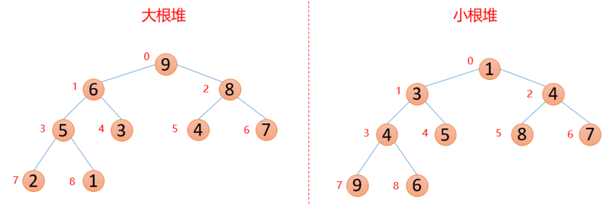

# 堆排序算法
堆的结构可以分为大根堆和小根堆，堆是一个完全二叉树，堆排序是根据堆的结构设计的排序算法。
## 大根堆和小根堆
**每个结点的值都大于其左孩子和右孩子结点的值，称之为大根堆；每个结点的值都小于其左孩子和右孩子结点的值，称之为小根堆。(如下图)**

## 堆排序的基本步骤
1. 首先将待排序的数组构造成一个大根堆，此时，整个数组的最大值就是堆结构的顶端
2. 将顶端的数与末尾的数交换，此时，末尾的数为最大值，剩余待排序数组个数为n-1
3. 将剩余的n-1个数再构造成大根堆，再将顶端数与n-1位置的数交换，如此反复执行，便能得到有序数组

假设存在以下数组：  
`arr = [3, 6, 8, 5, 7]`

1. 将每次新插入的数据都与其父结点进行比较，如果插入的数比父结点大，则与父结点交换，否则一直向上交换，直到小于等于父结点，或者来到了顶端。
2. 构造完成后，将顶端的数与最后一位数交换，交换完成后末尾的数是整个堆的最大值，固定不动，然后将剩余的数再构造成一个大根堆。
3. 拿顶端的数与其左右孩子较大的数进行比较，如果顶端的数大于其左右孩子较大的数，则停止，如果顶端的数小于其左右孩子较大的数，则交换，然后继续与下面的孩子进行比较。
4. 重复以上操作

# 总结
+ 堆排序的时间复杂度O(N*logN)
+ 空间复杂度O(1)
+ 是一个不稳定性的排序