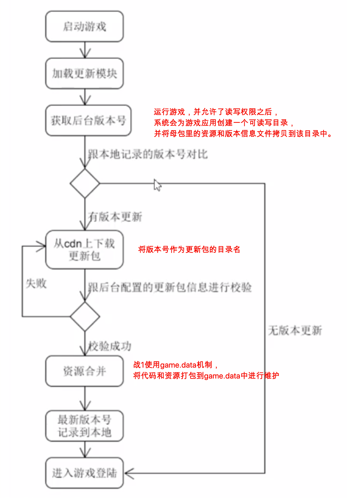
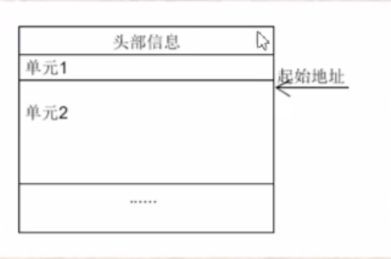
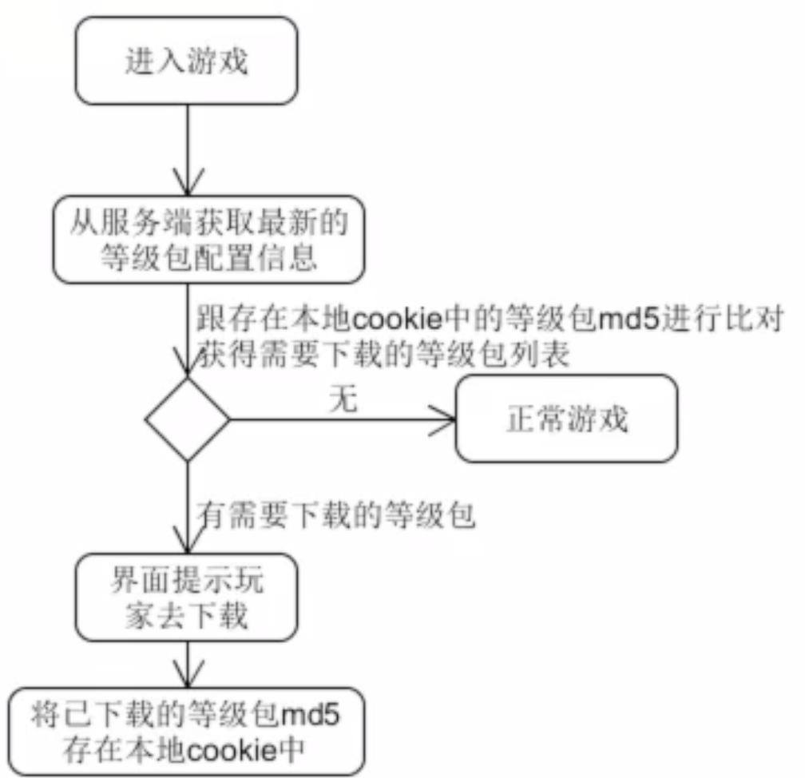
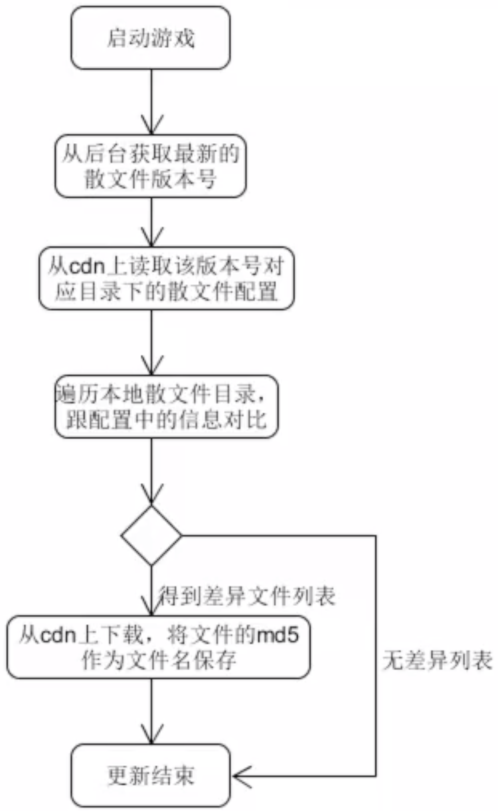
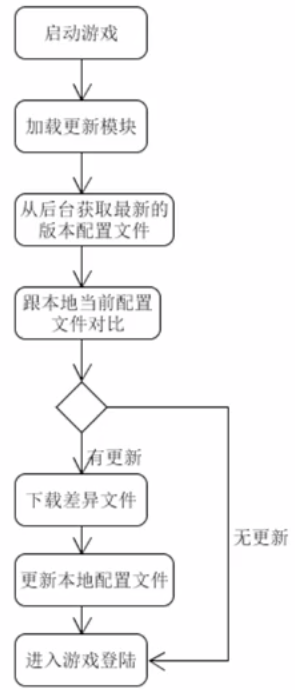
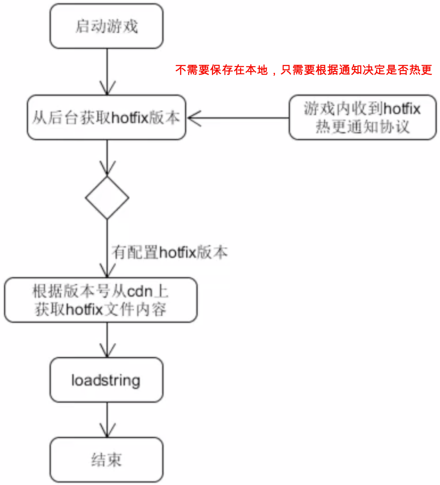
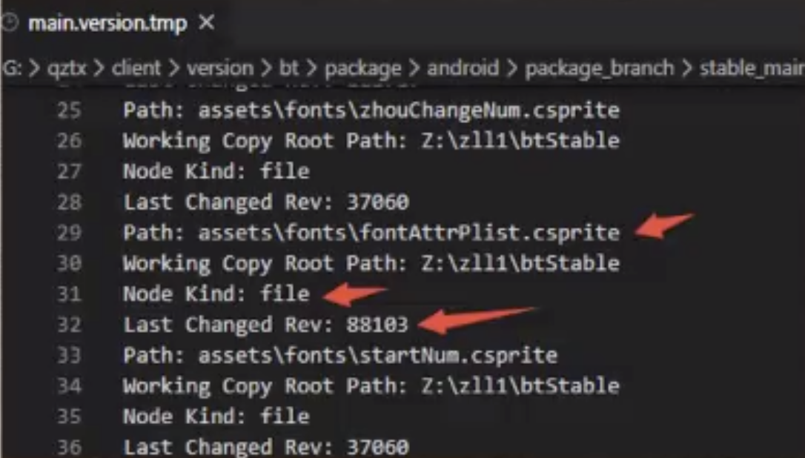

# 补丁包更新
## 主要内容
更新包和等级包。将新增和修改文件打包成压缩包，从cdn 上下载并解压到游戏目录进行文件更新。
### 补丁包更新流程

#### game.data的结构
数据头部+文件单元
头部数据中保存了头部数据长度、该文件中文件单元的数量、大小等信息
文件单元中保存有文件的大小、起始地址、标记等信息

### 等级包更新流程
等级包就是通过对游戏内的资源进行等级划分之后，玩家在达到了某个等级时，再将该等级对应的资源下载下来。

等级包跟更新包一样，使用game.data,区别在于等级包可以进入游戏后再下载
**等级包的优点**
1. 减少母包大小便于渠道推广和投放
2. 减少更新包大小，让玩家更快进入游戏
3. 减少流量消耗，玩家可以自己选择何时下载

# 差异文件更新（散文件更新）
微端的更新机制，散文件更新机制。cdn上有一份配置 文件来记录所有资源的md5,路径，版本等信息，然后与本地配置文件进行对比，得到差异文件列表，再根据配置中的信息找到cdn.上对应的目录下载资源、覆盖

散文件例子：`[" assets/media/display/horse/20065.csprite"]”{ A37F50A965AC8BFD60695E1481A6BCC1" ,32, 400}`

其中32指的是版本号，400指的是等级

**功能作用上跟等级包类似，也有分等级的机制，为什么要使用散文件呢?**

由于game.data通过fseek函数来设置文件指针的位置，而这个函数的参数是int类型的，也就是说它最多只能寻址2G的文件。战1项目的文件资源已经远远超过2G。

# 微端更新
微端，其实就是相当于把一小部分内容塞到包体里面，然后其他内容按需下载显示的包。不使用game.data的合并。

# 热更
通过Lua的loadstring的机制，玩家在游戏中时就能更新到一些代码，实现在线修复。

由于loadstring是在全局环境中进行编译，那么如果要修改包含了静态变量的函数，用正常的方式会有问题。

对于事先将数据缓存为文件内的静态变量保存起来的模块，需要先将它从package.loaded中清空一次， 再require, 才会生效

#### 思考
当hotfix中的内容很多时，loadstring会造成游戏卡顿，如何优化这种情况?

1. 战1中直接作为更新包打包出去
2. 分帧loadstring

# 游戏打包
## 更新打包
1. 稳定端中有一份配置文件记录了上次打包时所有文件资源的svn信息
    
2. 获取稳定端中最新的svn信息，跟上面的对比，将发生了版本号改变的文件记录下来，就得到了从上次打包至今发生了差异的文件，然后更新上面的配置文件。
3. 策划会将需要放到等级包的文件以及需要放到散文件更新的资源分别配置到excel中，将上面得到的差异文件分为三部分，等级包+散文件+剩下的部分作为更新包。
    
4. 对于等级包，将配置为相同等级的文件放在一起，打包成一一个 *.data文件，然后将这些*.data文件上传到cdn,并在后台修改配置
   
5. 对于散文件，获取上次散文件版本号+1,即为这次散文件版本，并以版本号为名创建目录，将所有差异散文件放到该目录里，并对应修改散文件配置。
   
6. 剩下的部分作为更新包的内容，打包成一个*.data文件，获取上次更新包的版本号+1,即为这次更新包版本，并以版本号为名创建目录，将*.data文件放入目录后上传到cdn并修改后台配置。
   
## 打包Android apk
1. AndroidManifest.xml 程序全局配置文件
2. classes.dex : Dalvik字节码
3. res\ :该目录存放资源文件(图片，文本，xm|布局)
4. assets\ :该目录可以存放一-些配置文件
5. lib\ :存放游戏所依赖的库
6. META-INF\ :该目录下存放的是签名信息

### 打包流程
1. 获取-份母包资源， game.data
等级包+散文件+母包>=游戏所有资源文件
2. 更新Version.xml,填入当前的更新版本号
3. 修改AndroidManifest.xml中的versionCode和versionName
4. 通过Android资源打包工具AAPT,打包res目录下的文件生成R.java文件.在这个过程中，项目中的AndroidManifest.xml文件和布局文件XML都会编译，然后生成相应的R.java,另外AndroidManifest.xml会被aapt编译成二 进制。
5. JAVAC工具将项目中所有的java文件，R.java文件、 游戏代码java文件编译成.class文件。
6. dex脚本将.class文件转换打包成一个.dex文件。 任何第三三方的libraries
和.class文件都会被转换成.dex文件。dx工具的主要工作是将Java字节码转成成Dalvik字节码可供Android系统Dalvik虚拟机执行、压缩常量池、消除冗余信息等。
7. 使用android sdk的sdklib工具，将资源文件和.dex文件生成末签名的.apk文件
8. 使用jarsigner对apk进行签名。
9. 使用zipalign工具对签名后的apk进行对齐处理，减少其在设备上运行时占用的内存。其主要过程是将APK包中所有的资源文件距离文件起始偏移为4字节整数倍，这样通过内存映射访问apk文件时的速度会更快
